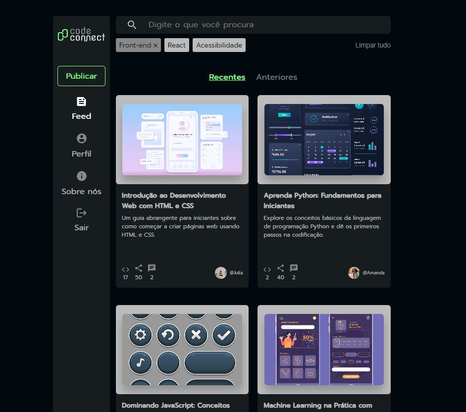

# CodeConnect



Este é um projeto chamado **CodeConnect**, criado com [React](https://reactjs.org/) e [Vite](https://vitejs.dev/), utilizando [Styled Components](https://styled-components.com/) para a estilização, Hooks do React e uma configuração de linting com ESLint.

## Funcionalidades

- **Vite**: Ferramenta de build rápida e otimizada.
- **React**: Framework para construção de interfaces de usuário interativas.
- **Styled Components**: Biblioteca para estilização dinâmica dentro de componentes.
- **Hooks do React**: Gerenciamento de estado e efeitos colaterais com hooks como `useState` e `useEffect`.
- **ESLint**: Ferramenta para garantir a qualidade do código com plugins específicos para React e Hooks.

## Pré-requisitos

- Node.js (você pode verificar se o Node está instalado com `node -v`)
- npm ou yarn como gerenciador de pacotes

## Instalação

1. Clone o repositório:

   ```bash
   git clone https://github.com/Fabricio-santuchi/code-connect.git
   ```

2. Entre no diretório do projeto:

   ```bash
   cd codeconnect
   ```

3. Instale as dependências:

   ```bash
   npm install
   ```

4. Inicie o servidor de desenvolvimento:

   ```bash
   npm run dev
   ```

## Scripts Disponíveis

- **`npm run dev`**: Inicia o servidor de desenvolvimento com Vite.
- **`npm run build`**: Cria a build de produção.
- **`npm run lint`**: Executa o ESLint para verificar a qualidade do código.
- **`npm run preview`**: Visualiza localmente a build de produção.

## Estrutura do Projeto

```bash
.
├── src
│   ├── components          # Componentes reutilizáveis
│   ├── assets              # Assets como ícones e imagens
│   ├── App.jsx             # Componente principal
│   └── main.jsx            # Ponto de entrada do React
├── public                  # Arquivos estáticos
├── package.json            # Dependências e scripts do projeto
├── vite.config.js          # Configurações do Vite
├── .eslintrc.js            # Configuração do ESLint
└── README.md               # Este arquivo
```

## Dependências

- **React**: ^18.3.1
- **React DOM**: ^18.3.1
- **Styled Components**: ^6.1.13

## Dependências de Desenvolvimento

- **ESLint**: ^9.11.1
- **Vite**: ^5.4.8
- **Plugins do ESLint**:
  - eslint-plugin-react
  - eslint-plugin-react-hooks
  - eslint-plugin-react-refresh

## Contribuição

Contribuições são bem-vindas! Se encontrar algum bug ou tiver sugestões, sinta-se à vontade para abrir uma issue ou enviar um pull request.

## Licença

Este projeto está licenciado sob a MIT License. Veja o arquivo [LICENSE](./LICENSE) para mais detalhes.
